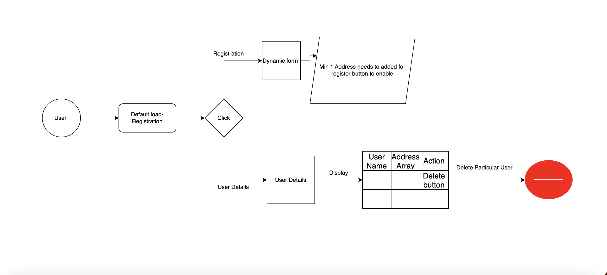

# user-signup
Angular project to demonstrate simple user registration and to display user details on UI

## Approach



## Things to enhance

- Code refactor
- Better UI/UX
- Better Validations

## Table of Contents

- [About](#about)
- [Prerequisites](#prerequisites)
- [Installation](#installation)
- [Running the Application](#running-the-application)

## About

This project showcases the integration of Angular with Angular Material, a popular UI component library, to create a modern and responsive web application.

## Prerequisites

Before you begin, ensure you have met the following requirements:

- Node.js and npm installed on your machine.
- Angular CLI (Command Line Interface) installed globally. You can install it using the following command:

   ```bash
   npm install -g @angular/cli
